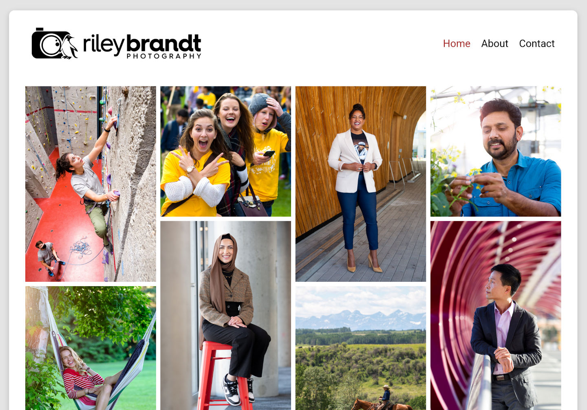

# Development Website

The development website for rileybrandt.com.

## To Do List

- Code the Hamburger Menu button
- About page contents
- CSS sytling of about page blocks
- Finalise colour scheme
- Add contact form backend
- Finish Contact page blurb
- Take a new headshot/selfie for the About page
- Fix all the media queries/responsive layouts

## Required for live push

- Working contact form
- A lessons page
- Working hamburger menu
- Home, About, Contact (Portfolio page can be added later)
- Blog: FOSS photography workflow post

## Pages to Code

- Homepage
- About
- Contact
- Lessons
- FOSS photography workflow blog post

## Post launch ideas

- Photo Gallery: Campus Life
- Photo Gallery: Portraits
- Photo Gallery: Events
- Photo Gallery: News/Media

## Fine Tuning

- Switch to local fonts (need to set weights)
- Switch to --var colours
- Convert all images to WebP format
